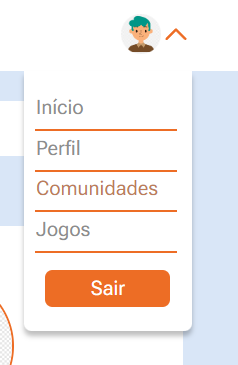
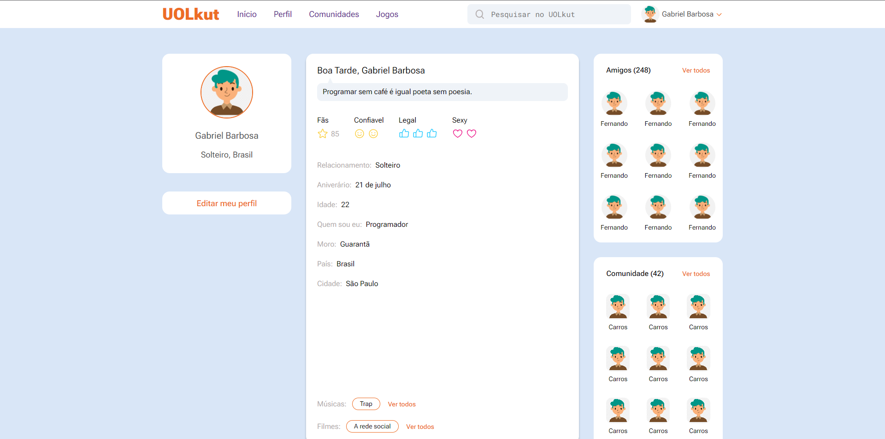
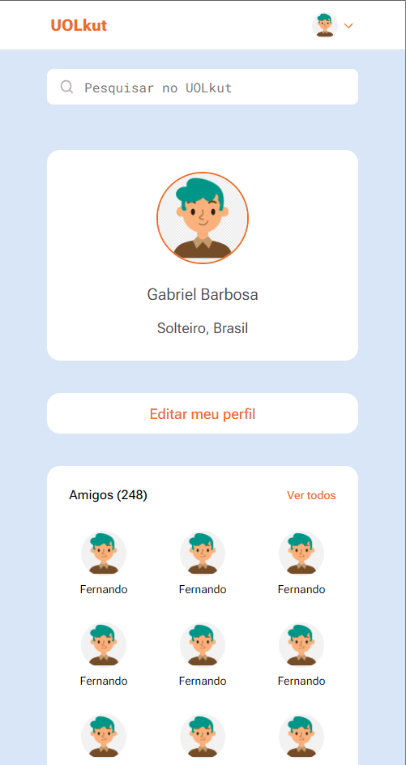
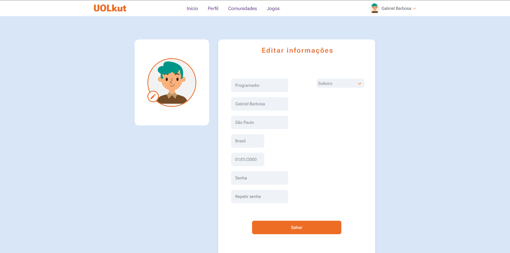
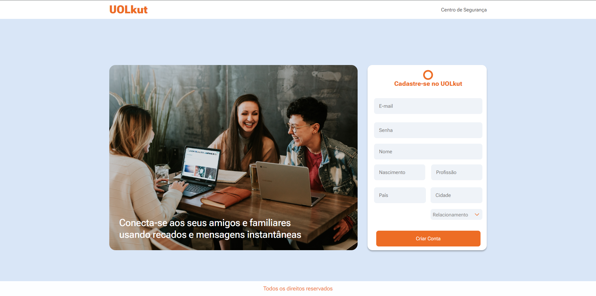
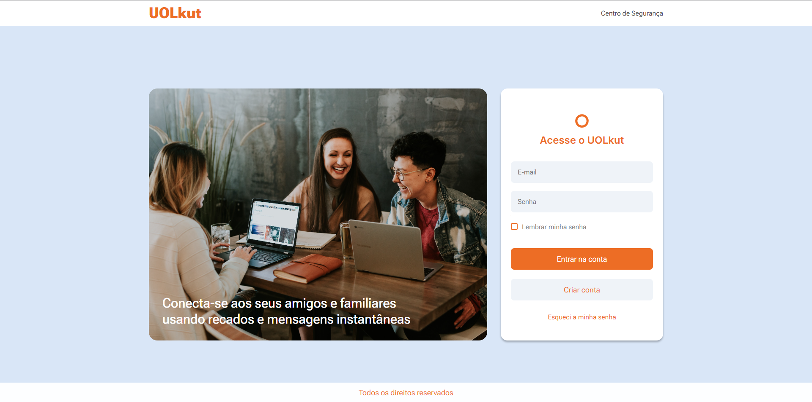
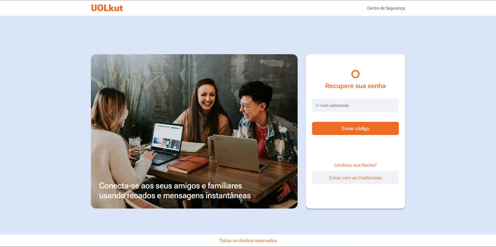
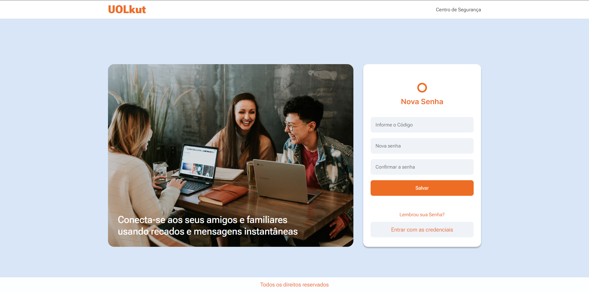
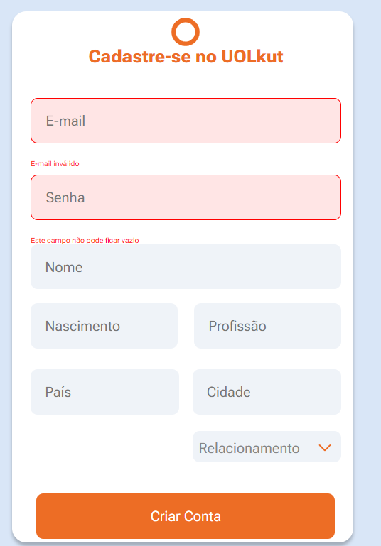

<h1>UOLkut</h1>

<h2>📗About The Project</h2>
<p>
UOLkut is a Compass UOL challenge, which aims to apply and improve the skills acquired throughout the Scholarship Program (PB). This project involves creating a modern social media platform
<p>
<p>The project was initially for screens such as 360px and 1920px and adapted for the respective screens, it has the functionality to register and log in with the registered data, to authenticate the user Firebase was used</p>

<h2> 📈 Objective</h2>
<p>The main objective of the UOLkut project is to provide participants in the Compass UOL Scholarship Program with the opportunity to put into practice the knowledge acquired in programming, interface design and web development. Through this challenge, we hope to promote practical learning and skill development in a real project environment.

This is the second part, The main objective is to implement an API where the user can register, log in with the registered data and edit the data that has been registered

</p>

<h2>👨‍💻 Participants</h2>

| Name   | GitHub                                                 | Linkedin                                                                            |
| ------ | ------------------------------------------------------ | ----------------------------------------------------------------------------------- |
| Murilo | <a href="https://github.com/xmurilo">Github/Murilo</a> | <a href="https://www.linkedin.com/in/murilo-silva-a85b7526b/"> Linkedin/Murilo </a> |

<h2>💠 Core Technologies</h2>
<div align="center">
    
  
  
  


</div>

<h2>📕 Libraries</h2>

| Library           | Version |
| ----------------- | ------- |
| React             | 18.2.0  |
| React-dom         | 18.2.0  |
| React-router-dom  | 6.16.0  |
| React-scripts     | 5.0.1   |
| styled-components | 6.0.8   |
| typescript        | 4.9.5   |
| js-cookie         | 3.0.5   |
| JSON Server       | 0.17.4  |

<h2>⭐ Functionalities</h2>

<ul>
  <li>A menu has been implemented in the Profile page in the header on only screens below 1024px </li>
  <hr/>
  <li>On the registration screen, data such as email and password are registered in Firebase</li>
  <hr/>
  <li>Log in with authentication and display registered data</li>
  <hr/>
  <li>The user can log in with the data that was registered</li>
  <hr/>
  <li>
User data was also registered in json-server</li>
<hr/>
<li>
Loading between screens has been added</li>
<hr/>
<li>Error handling when the user logs in incorrectly or tries to register an existing account</li>
<hr/>
<li>Protected routes, which the user cannot access profile pages if they are not logged in</li>
<hr/>
<li>Saving the user's uid and access token in Cookies</li>
</ul>

<h3>The Menu in the Profile Page</h3>
<div align="center">
  
</div>
<h3 >Responsive screens</h3>
<h4>Profile Page</h4>
<div align="center">
  
  
</div>

<h3  >Edit Profile Page</h3>
<div align="center">
  
</div>

<h3>Register Page</h3>
<div align="center">
  
</div>

<h3>Login Page</h3>
<p>To log in and go to the profile page you have to enter your email as "usuario@gmail.com", password as "123"<p>
<div align="center">
  
</div>

<h3>Forgot password page</h3>
<div align="center">
  
</div>

<h3>New password page</h3>
<div align="center">
  
</div>

<h3>Empty input</h3>
<div align="center">
  
</div>

<h2>📚 How to run the project</h2>

<p>Before you begin, you will need to have the following tools installed on your machine: <a href="https://git-scm.com/">Git</a>, <a href="https://nodejs.org/en/">Node.js</a> and <a href="https://code.visualstudio.com/">VSCode</a>.</p>

<h3>🎲 Running the project</h3>

```bash
# Clone this repository
$ git clone https://github.com/xmurilo/projeto-compass-desafio-x.git

# Access the project folder in the terminal/cmd
$ cd projeto-compass-desafio-x

# First you need for simulate a Database, install JSON Server with global scope
$ npm install -g json-server

# After this install the rest dependencies for running the project
$ npm install

# Run the application in development mode
$ npm start

# The server will start at port:3000 - access http://localhost:3000

# Run the server on the port 3333
$ json-server --watch src/mock/db.json --port 3333

# With this you can run the project
```

<h2>🤝 Acknowledgements</h2>
<p>Thanks to <a href="https://compass.uol/en/home/">Compass UOL</a> for the opportunity to develop this project.</p>

<p>Thank you to all the instructors, such as Cássio, Higor, Leonardo, Rafael, who in some way helped the success of everyone in the group</p>
